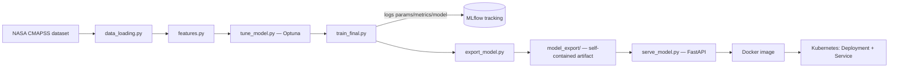

# predictive-maintenance-rul


An end-to-end MLOps pipeline that predicts Remaining Useful Life (RUL) for
turbofan engines, from raw sensor data to a served, containerized,
orchestrated API — with experiment tracking and quality gates enforced by CI.

Built as a portfolio project to demonstrate the ML platform / MLOps side of
data science: experiment tracking, hyperparameter optimization, model
serving, containerization, Kubernetes orchestration, and automated testing —
skills relevant to production-grade ML systems roles.

## What it does

1. Loads and explores NASA's CMAPSS turbofan degradation dataset.
2. Engineers features: drops zero-variance sensors, caps RUL at a
   physically-motivated threshold, splits train/validation by engine
   (not by row) to avoid leakage between near-identical consecutive cycles.
3. Trains a Random Forest baseline, then tunes it with Optuna
   (Bayesian hyperparameter search).
4. Tracks every training run — parameters, metrics, and the model itself —
   with MLflow.
5. Exports the best run as a self-contained artifact (no dependency on the
   tracking store or any absolute host path).
6. Serves predictions through a FastAPI service (`/predict`, `/health`).
7. Containerizes the service with Docker, orchestrates it on Kubernetes
   (Deployment + Service, 2 replicas, liveness/readiness probes).
8. Runs the entire pipeline — dataset download, training, quality-gated
   tests, API tests, Docker build — automatically on every push via
   GitHub Actions.

## Architecture



| Component | Role |
|---|---|
| `data_loading.py` | Loads CMAPSS train/test files, computes RUL for training data |
| `eda.py` | Identifies zero-variance sensors, plots degradation trends |
| `features.py` | RUL capping, group-aware train/validation split, feature selection |
| `train_model.py` | Baseline Random Forest (untuned) |
| `tune_model.py` | Optuna hyperparameter search |
| `train_final.py` | Trains with best params, logs everything to MLflow |
| `export_model.py` | Exports the best MLflow run as a standalone, portable artifact |
| `serve_model.py` | FastAPI service — loads the exported model, serves predictions |
| `Dockerfile` / `docker-compose.yml` | Containerizes the serving API |
| `k8s/` | Kubernetes Deployment + Service manifests |
| `.github/workflows/ci.yml` | Reproduces the full pipeline and gates on tests passing |

## Results

Random Forest, tuned with 30 Optuna trials, on FD001 (the simplest CMAPSS
subset — 100 engines, 1 operating condition, 2 fault modes):

| Model | Validation MAE | Validation RMSE |
|---|---|---|
| Baseline (untuned) | 12.43 cycles | 17.02 cycles |
| Optuna-tuned | 12.36 cycles | 16.80 cycles |

The most important sensor by a wide margin was `sensor_11` (static pressure
at HPC outlet) — consistent with published CMAPSS literature, which is a
good sanity check that the model is learning real degradation signal rather
than noise.

## Requirements

- Python 3.11+
- Docker Desktop (with Kubernetes enabled, kubeadm provisioner — see
  [Known limitations](#known-limitations--declared-assumptions))

## Setup

```bash
python -m venv venv
venv\Scripts\activate          # Windows
pip install -r requirements.txt
```

Download the dataset (official NASA repository, no account needed):
```bash
mkdir data
curl -L -o data/cmapss.zip "https://phm-datasets.s3.amazonaws.com/NASA/6.+Turbofan+Engine+Degradation+Simulation+Data+Set.zip"
tar -xf data/cmapss.zip -C data
```

## Running the pipeline

From `src/`:
```bash
python eda.py              # optional: sensor exploration
python train_model.py      # baseline
python tune_model.py       # Optuna search
python train_final.py      # final training run, logged to MLflow
python export_model.py     # exports the best run as a standalone artifact
python serve_model.py      # serves the exported model on :8000
```

View tracked experiments (from the project root):
```bash
mlflow ui --backend-store-uri sqlite:///mlflow_data/mlflow.db
```

## Testing

```bash
pytest tests/ -v -rs
```

- `test_model_quality.py` — evaluates the exported model against
  validation data, with MAE/RMSE quality-gate thresholds. Runs standalone.
- `test_api_predictions.py` — sends real test-set sensor readings to the
  live API and checks predictions against actual RUL. Requires
  `serve_model.py` to be running; skips (not fails) otherwise.

## Docker

```bash
docker compose up --build
curl http://localhost:8000/health
```

## Kubernetes

Requires a locally-built image and Docker Desktop's Kubernetes enabled
(**kubeadm** provisioner — see [Known limitations](#known-limitations--declared-assumptions)):

```bash
docker build -t cmapss-rul-api:latest .
kubectl apply -f k8s/deployment.yaml
kubectl apply -f k8s/service.yaml
kubectl get pods
```

Verify (works even if the LoadBalancer external IP is stuck pending — see
limitations below):
```bash
kubectl port-forward svc/rul-api-service 8000:8000
curl http://localhost:8000/health
```

## CI/CD

`.github/workflows/ci.yml` runs on every push and pull request to `main`:
downloads the dataset, trains and exports the model, runs the model-quality
test suite, starts the API, runs the API test suite against it, and — only
if all of that passes — builds the Docker image. A failing pipeline blocks
the merge.

## Known limitations & declared assumptions

- **RUL cap (125 cycles)**: the model cannot distinguish "300 cycles left"
  from "280 cycles left" from sensors that show no degradation signal yet —
  predictions are capped accordingly. This is by design, not a bug.
- **FD001 only**: the simplest of the four CMAPSS sub-datasets. Extending to
  FD002–FD004 (multiple operating conditions/fault modes) is straightforward
  but not yet done.
- **Tabular, not sequential**: each row is treated independently, with no
  memory of a given engine's earlier cycles. A sequence-aware model (rolling
  windows, or an LSTM) would likely outperform this approach on CMAPSS —
  a deliberate scope decision, not an oversight.
- **Kubernetes cluster provisioner**: this project was developed against
  Docker Desktop's **kubeadm**-based single-node cluster. The alternative
  **kind**-based provisioner runs each node as a separate Docker container
  with its own isolated image store, so locally-built images are not
  automatically visible to it (`ErrImageNeverPull`) — `kubeadm` was chosen
  specifically to avoid that extra step.
- **Kubernetes LoadBalancer**: on Docker Desktop, external IP assignment for
  `LoadBalancer` services can get stuck in `<pending>` indefinitely (more
  common after switching between the kind/kubeadm cluster providers). The
  service itself works correctly — verified both with `kubectl port-forward`
  and with a direct in-cluster query to the Service.
- **No drift detection**: planned (comparing live prediction-time feature
  distributions against the training distribution) but not yet implemented.
- **No RAG layer**: planned (a small retrieval-augmented assistant to answer
  questions about model results/logs) but not yet implemented.
- **No branch protection rule**: the CI pipeline runs and reports status,
  but merging to `main` isn't yet actually blocked on it passing.

## Licensing

This repository is licensed under **Apache-2.0** (see `LICENSE`).

Dependencies carry their own licenses — all permissive (MIT/BSD-style) or
Apache-2.0, including MLflow, FastAPI, scikit-learn, and Optuna.