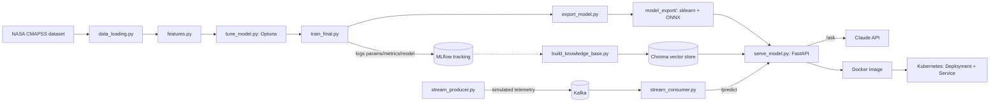

# predictive-maintenance-rul


An end to end MLOps pipeline that predicts Remaining Useful Life (RUL) for turbofan engines, going from raw sensor data all the way to a served, containerized, orchestrated API. It includes experiment tracking, a RAG assistant, real time streaming inference, and quality gates enforced by CI.

Built as a portfolio project to show the ML platform side of data science: experiment tracking, hyperparameter optimization, model serving and export formats, containerization, Kubernetes orchestration, event streaming, retrieval augmented generation, and automated testing.

**Platform note:** the codebase itself is cross platform. Every file path is handled with Python's `pathlib`, and the Docker, Kubernetes, and Kafka commands are identical on any OS. This was built and tested on Windows. The only steps that differ by system are activating the Python virtual environment and setting an environment variable, and both are shown below for Windows, macOS, and Linux.

## What it does

1. Loads and explores NASA's CMAPSS turbofan degradation dataset.
2. Engineers features: drops sensors with zero variance, caps RUL at a physically motivated threshold, and splits train/validation by engine rather than by row, so nearly identical consecutive cycles from the same engine never leak across both sets.
3. Trains a Random Forest baseline, then tunes it with Optuna using Bayesian hyperparameter search.
4. Tracks every training run (parameters, metrics, and the model itself) with MLflow.
5. Exports the best run as a self contained artifact, in both native scikit-learn format and ONNX, with the ONNX version verified to produce the same predictions as the original.
6. Serves predictions through a FastAPI service (`/predict`, `/health`).
7. Answers natural language questions about the model, its sensors, and its training history through a RAG assistant (`/ask`). Chroma handles retrieval, Claude handles generation.
8. Streams simulated real time engine telemetry through Kafka, with a consumer that scores each reading against the live API as it arrives.
9. Containerizes the service with Docker and orchestrates it on Kubernetes (Deployment plus Service, 2 replicas, liveness and readiness probes).
10. Runs the entire pipeline (dataset download, training, quality gated tests, API tests, Docker build) automatically on every push through GitHub Actions.

## Architecture



| Component | Role |
|---|---|
| `data_loading.py` | Loads CMAPSS train/test files and computes RUL for training data |
| `eda.py` | Identifies zero variance sensors and plots degradation trends |
| `features.py` | RUL capping, group aware train/validation split, feature selection |
| `train_model.py` | Baseline Random Forest, untuned |
| `tune_model.py` | Optuna hyperparameter search |
| `train_final.py` | Trains with the best params and logs everything to MLflow |
| `export_model.py` | Exports the best MLflow run as a standalone, portable artifact |
| `export_onnx.py` / `verify_onnx.py` | Converts the model to ONNX and confirms predictions match the original |
| `build_knowledge_base.py` | Indexes the sensor glossary, project facts, and MLflow run history into Chroma |
| `serve_model.py` | FastAPI service for predictions (`/predict`) and RAG Q&A (`/ask`) |
| `stream_producer.py` / `stream_consumer.py` | Simulates and scores real time engine telemetry through Kafka |
| `Dockerfile` / `docker-compose.yml` | Containerizes the serving API, plus Kafka and Kafka UI |
| `k8s/` | Kubernetes Deployment and Service manifests |
| `.github/workflows/ci.yml` | Reproduces the full pipeline and gates on tests passing |

## Results

Random Forest, tuned with 30 Optuna trials, on FD001 (the simplest CMAPSS subset: 100 engines, one operating condition, two fault modes):

| Model | Validation MAE | Validation RMSE |
|---|---|---|
| Baseline (untuned) | 12.43 cycles | 17.02 cycles |
| Optuna tuned | 12.36 cycles | 16.80 cycles |

The most important sensor by a wide margin was `sensor_11` (static pressure at HPC outlet), which matches what's reported in published CMAPSS literature.

## Requirements

- Python 3.11 or newer
- Docker Desktop, with Kubernetes enabled (**kubeadm** provisioner; see [Known limitations](#known-limitations--declared-assumptions))
- An Anthropic API key for the `/ask` RAG endpoint, generated at [console.anthropic.com](https://console.anthropic.com)

## Setup

```bash
python -m venv venv
```

Activate it:
```bash
# Windows (cmd.exe or PowerShell)
venv\Scripts\activate

# macOS / Linux
source venv/bin/activate
```

Install dependencies:
```bash
pip install -r requirements.txt
```

Download the dataset. It's the official NASA repository, no account needed, and `curl` and `tar` ship with modern Windows, macOS, and Linux, so this step is the same on all three:
```bash
mkdir data
curl -L -o data/cmapss.zip "https://phm-datasets.s3.amazonaws.com/NASA/6.+Turbofan+Engine+Degradation+Simulation+Data+Set.zip"
tar -xf data/cmapss.zip -C data
```

## Running the pipeline

From `src/`:
```bash
python eda.py                    # optional: sensor exploration
python train_model.py            # baseline
python tune_model.py             # Optuna search
python train_final.py            # final training run, logged to MLflow
python export_model.py           # exports the best run as a standalone artifact
python export_onnx.py            # converts to ONNX
python verify_onnx.py            # confirms ONNX predictions match the original
python build_knowledge_base.py   # indexes the RAG knowledge base
python serve_model.py            # serves the model and the RAG assistant
```

View tracked experiments from the project root:
```bash
mlflow ui --backend-store-uri sqlite:///mlflow_data/mlflow.db
```

## RAG assistant

The `/ask` endpoint uses Claude, Anthropic's API, to generate answers grounded in the retrieved context. Chroma handles retrieval and Claude handles generation. Set your API key as an environment variable before starting `serve_model.py`:

```bash
# Windows cmd.exe
set ANTHROPIC_API_KEY=your_key_here

# Windows PowerShell
$env:ANTHROPIC_API_KEY="your_key_here"

# macOS / Linux
export ANTHROPIC_API_KEY=your_key_here
```

(each of these only lasts for the current terminal session)

```bash
curl -X POST http://127.0.0.1:8000/ask \
  -H "Content-Type: application/json" \
  -d '{"question": "What does sensor_11 measure and why is it important?"}'
```

Retrieval combines semantic search (Chroma's default embedding model) with exact keyword matching for sensor IDs, since semantic search alone struggles to tell apart near identical strings like `sensor_11` and `sensor_12`.

## Real time streaming

Simulates live telemetry for one engine and scores each reading against the running API as it arrives:

```bash
docker compose up --build      # starts the API, Kafka, and Kafka UI
python src/stream_consumer.py  # start the consumer first
python src/stream_producer.py  # then the producer
```

Kafka UI for inspecting the topic: `http://localhost:8088`

## Testing

```bash
pytest tests/ -v -rs
```

`test_model_quality.py` evaluates the exported model against the validation data, with MAE/RMSE quality gate thresholds. It runs on its own, no other services required.

`test_api_predictions.py` sends real test set sensor readings to the live API and checks the predictions against the actual RUL. It needs the API running, and skips instead of failing if it isn't.

## Docker

```bash
docker compose up --build
curl http://localhost:8000/health
```

## Kubernetes

Needs a locally built image and Kubernetes enabled in Docker Desktop (**kubeadm** provisioner; see [Known limitations](#known-limitations--declared-assumptions)):

```bash
docker build -t cmapss-rul-api:latest .
kubectl apply -f k8s/deployment.yaml
kubectl apply -f k8s/service.yaml
kubectl get pods
```

Verify it (this works even if the LoadBalancer's external IP is stuck pending; see the limitations below):
```bash
kubectl port-forward svc/rul-api-service 8000:8000
curl http://localhost:8000/health
```

## CI/CD

`.github/workflows/ci.yml` runs on every push and pull request to `main`. It downloads the dataset, trains and exports the model, runs the model quality test suite, starts the API, runs the API test suite against it, and only builds the Docker image if all of that passes. A failing pipeline blocks the merge.

## Known limitations & declared assumptions

**RUL cap at 125 cycles.** The model can't tell "300 cycles left" apart from "280 cycles left" when the sensors don't show any degradation signal yet, so predictions are capped accordingly. This is by design, not a bug.

**FD001 only.** The simplest of the four CMAPSS sub-datasets. Extending to FD002 through FD004 would be straightforward but hasn't been done yet.

**Tabular, not sequential.** Each row is treated independently, with no memory of a given engine's earlier cycles. A sequence aware model would likely do better on CMAPSS. This was a deliberate scope decision.

**The RAG assistant only knows what's indexed**: the sensor glossary, a fixed set of declared project facts, and MLflow run history. It can't answer questions outside that scope on purpose. The system prompt tells it to say so instead of guessing.

**The Kafka setup is single broker and meant for development.** No replication, no authentication, no production hardening. It's enough to demonstrate the streaming pattern, not to run in production.

**Kubernetes cluster provisioner.** This was built against Docker Desktop's kubeadm based single node cluster. The alternative kind based provisioner runs each node as a separate Docker container with its own isolated image store, so locally built images aren't automatically visible to it (you'd get `ErrImageNeverPull`). Using kubeadm avoids that extra step.

**Kubernetes LoadBalancer.** On Docker Desktop, external IP assignment for `LoadBalancer` services can get stuck at `<pending>` indefinitely, even when the service underneath is working fine. This was verified both with `kubectl port-forward` and with a direct in cluster query to the Service. It's a known limitation of running Kubernetes locally on Windows, and doesn't show up on cloud providers like GKE, EKS, or AKS, which assign external IPs automatically.

**No drift detection yet.** The plan is to compare live prediction time feature distributions against the training distribution, but it isn't built yet.

**No branch protection rule yet.** The CI pipeline runs and reports its status, but merging to `main` isn't actually blocked on it passing.

## Licensing

This repository is licensed under Apache-2.0 (see `LICENSE`).

Dependencies carry their own licenses, all permissive (MIT/BSD style) or Apache-2.0, including MLflow, FastAPI, scikit-learn, Optuna, Chroma, and confluent-kafka-python.